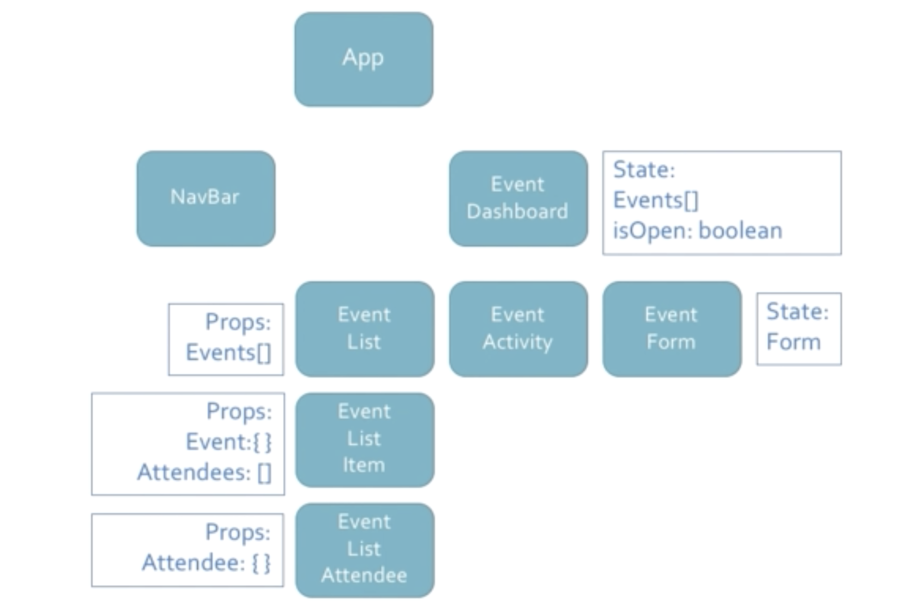

# Tools:
- React
- SemanticUI React: [doc](https://react.semantic-ui.com/)

# Packages Used:
- React Router 4 
- Redux forms
- Google Map React
- React Places Autocomplete
- React Dropzone
- React Cropper
- Date FNX
- React Datepicker

# Notes:
* Where state should live 
    
* 